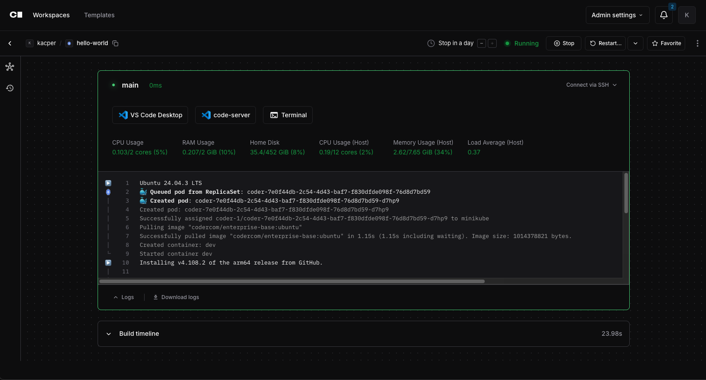

# coder-logstream-kube

[](https://discord.gg/coder)
[](https://github.com/coder/envbuilder/pkgs/container/coder-logstream-kube)
[](https://pkg.go.dev/github.com/coder/coder-logstream-kube)
[](./LICENSE)

Stream Kubernetes Pod events to the Coder startup logs.

- Easily determine the reason for a pod provision failure, or why a pod is stuck in a pending state.
- Visibility into when pods are OOMKilled, or when they are evicted.
- Filter by namespace, field selector, and label selector to reduce Kubernetes API load.



## Usage

Apply the Helm chart to start streaming logs into your Coder instance:

```console
helm repo add coder-logstream-kube https://helm.coder.com/logstream-kube
helm install coder-logstream-kube coder-logstream-kube/coder-logstream-kube \
    --namespace coder \
    --set url=<your-coder-url-including-http-or-https>
```

> **Note**
> For additional customization (such as customizing the image, pull secrets, annotations, etc.), you can use the
> [values.yaml](helm/values.yaml) file directly.

Your Coder template should be using a `kubernetes_deployment` resource with `wait_for_rollout` set to `false`.

```hcl
resource "kubernetes_deployment" "hello_world" {
  count = data.coder_workspace.me.start_count
  wait_for_rollout = false
  ...
}
```

This ensures all pod events will be sent during initialization and startup.

## How?

Kubernetes provides an [informers](https://pkg.go.dev/k8s.io/client-go/informers) API that streams pod and event data from the API server.

`coder-logstream-kube` listens for pod creation events with containers that have the `CODER_AGENT_TOKEN` environment variable set. All pod events are streamed as logs to the Coder API using the agent token for authentication.

## Custom Certificates

- [`SSL_CERT_FILE`](https://go.dev/src/crypto/x509/root_unix.go#L19): Specifies the path to an SSL certificate.
- [`SSL_CERT_DIR`](https://go.dev/src/crypto/x509/root_unix.go#L25): Identifies which directory to check for SSL certificate files.
